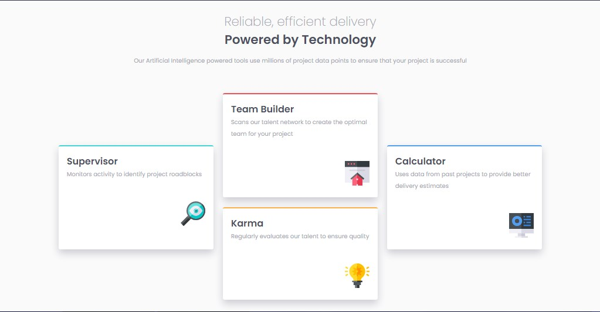

# Frontend Mentor - Four card feature section solution

This is a solution to the [Four card feature section challenge on Frontend Mentor](https://www.frontendmentor.io/challenges/four-card-feature-section-weK1eFYK). Frontend Mentor challenges help you improve your coding skills by building realistic projects. 

## Table of contents

- [Overview](#overview)
  - [The challenge](#the-challenge)
  - [Screenshot](#screenshot)
  - [Links](#links)
- [My process](#my-process)
  - [Built with](#built-with)
  - [What I learned](#what-i-learned)
  - [Continued development](#continued-development)
  - [Useful resources](#useful-resources)
- [Author](#author)

## Overview

### The challenge

Users should be able to:

- View the optimal layout for the site depending on their device's screen size

### Screenshot

### Links

- [Solution URL](https://www.frontendmentor.io/solutions/four-card-feature-section-challenge-solution-b5IxImXbvJ)
- [Live site](https://6xg0d.github.io/four-card-section-challenge/)

## My process

Grid is still being complicate to me, but i figured out the basics and was able to complete the challenge. Still having to improve a few details, but to be my first time with grid, i think isn't too bad! :)

### Built with

- Semantic HTML5 markup
- CSS
- Flexbox
- CSS Grid
- Mobile-first workflow

### What I learned

I learned the basics of CSS grid. Still having to practice and get used to it, but i was great to learn something new! Also i used the CSS position property (never used before) and it was awesome how i recognized that it'd help me in this challenge, so i'm proud that i'm getting better after practicing with the challenges.

### Continued development

I'm quiet happy with the results, but after getting better with Grid i'll come back and optimize the CSS file. Also to set the svg on the bottom right side better, i used margin-top:15%, but still doesn't look exactly as it should, and make the "karma" card the same size as the other ones. For some reason, after relocate it at the bottom it gets a little bit smaller than this other.

### Useful resources

- [Manz.dev Grid article](https://lenguajecss.com/css/maquetacion-y-colocacion/grid-css/) - This helped me to understand how grid works. (spanish language resource)
- [Midudev Grid Crash Course](https://www.youtube.com/watch?v=iTjkiI8QQsM) - This course also helped me to get used to the basics of grid. (spanish language resource)

## Author

- Frontend Mentor - [@6xg0d](https://www.frontendmentor.io/profile/6xg0d)
